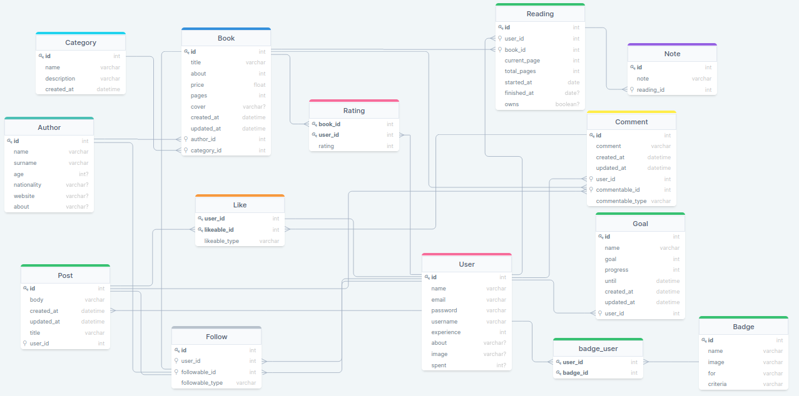

# API Documentation

- [API Documentation](#api-documentation)
  - [Database schema](#database-schema)
  - [Routes](#routes)
    - [Common Routes](#common-routes)
      - [Login](#login)
      - [Registration](#registration)
      - [Users](#users)
  - [`GET` Routes available to GUEST user's](#get-routes-available-to-guest-users)
    - [Books](#books)
    - [Categories](#categories)
    - [Posts](#posts)
      - [Post comments](#post-comments)
    - [Authors](#authors)
      - [Author books](#author-books)
        - [Author book comments](#author-book-comments)
  - [Logged in user accessable routes](#logged-in-user-accessable-routes)
    - [Goals](#goals)
    - [Readings](#readings)
    - [Reading Notes](#reading-notes)
    - [Auth `GET` Badges](#auth-get-badges)
    - [Post management](#post-management)
    - [Post comments management](#post-comments-management)
  - [Admin accessable routes](#admin-accessable-routes)
    - [Category management](#category-management)
    - [Badge management](#badge-management)
    - [Author management](#author-management)
    - [Author Book management](#author-book-management)
    - [Admin Post management](#admin-post-management)

## Database schema

Database to relate to when working with this RESTful API

## Routes

### Common Routes

this section show common system routes, that are accesible for guest users

#### Login

- Route: `api/login`
- Method: `POST`

#### Registration

- Route: `api/register`
- Method: `POST`

#### Users

- Route: `api/users`
- Method: `GET`

---

- Route: `api/users/{username}`
- Method: `GET`

## `GET` Routes available to GUEST user's

### Books

- Route: `api/books`
- Method: `GET`
- Returns: all books

 ---

- Route: `api/books/{book-slug}`
- Method: `GET`
- Returns: get specific book

### Categories

- Route: `api/categories`
- Method: `GET`
- Returns: all categories

 ---

- Route: `api/categories/{category}`
- Method: `GET`
- Returns: specific category

### Posts

- Route: `api/posts`
- Method: `GET`
- Returns: all posts

 ---

- Route: `api/posts/{post-slug}`
- Method: `GET`
- Returns: specific post

#### Post comments

- Route: `api/posts/{post-slug}/comments`
- Method: `GET`
- Returns: all post comments

 ---

- Route: `api/posts/{post-slug}/comments/{comment}`
- Method: `GET`
- Returns: specific post comment

### Authors

- Route: `api/authors`
- Method: `GET`
- Returns: all authors

 ---

- Route: `api/authors/{author}`
- Method: `GET`
- Returns: specific author

#### Author books

- Route: `api/authors/{author}/books`
- Method: `GET`
- Returns: all author books

 ---

- Route: `api/authors/{author}/books/{book}`
- Method: `GET`
- Returns: specific author's book

##### Author book comments

- Route: `api/authors/{author}/books/{book-slug}/comments`
- Method: `GET`
- Returns: all author book comments

 ---

- Route: `api/authors/{author}/books/{book-slug}/comments/{comment}`
- Method: `GET`
- Returns: specific author's book comment

## Logged in user accessable routes

- Route: `api/badges`
- Method: `GET`
- Returns: available badge list
  
---

- Route: `api/auth`
- Method: `GET`
- Returns: logged in user's info

---

- Route: `api/auth/alive`
- Method: `POST`
- Returns: refreshed `JWT` token

---

- Route: `api/auth/badges`
- Method: `GET`
- Returns: logged in user's badge list

---

- Route: `api/auth/follows`
- Method: `GET`
- Returns: all books, users and posts that currently logged in user follows

 ---

- Route: `api/auth/follows`
- Method: `POST`
- Returns: started following user, book or post, on unfollowed if already follows.

### Goals

- Route: `api/auth/goals`
- Method: `GET`
- Returns: all authenticated user's goals

 ---

- Route: `api/auth/goals/{goal}`
- Method: `GET`
- Returns: get specific goal of authenticated user

- Route: `api/auth/goals`
- Method: `POST`
- Returns: newly added goal instance

---

- Route: `api/auth/goals/{goal}`
- Method: `PATCH`
- Returns: patched goal's information

---

- Route: `api/auth/goals/{goal}`
- Method: `DELETE`
- Returns: destroyed goal's information

### Readings

- Route: `api/auth/readings`
- Method: `GET`
- Returns: all authenticated user's readings

 ---

- Route: `api/auth/readings/{reading}`
- Method: `GET`
- Returns: get specific reading of authenticated user

---

- Route: `api/auth/readings`
- Method: `POST`
- Returns: newly added reading instance

---

- Route: `api/auth/readings/{reading}`
- Method: `PATCH`
- Returns: patched reading's information

---

- Route: `api/auth/readings/{reading}`
- Method: `DELETE`
- Returns: destroyed reading's information

### Reading Notes

- Route: `api/auth/readings/{reading}/notes`
- Method: `GET`
- Returns: all authenticated user's reading notes

 ---

- Route: `api/auth/readings/{reading}/notes/{note}`
- Method: `GET`
- Returns: get specific note of authenticated user

---

- Route: `api/auth/readings/{reading}/notes`
- Method: `POST`
- Returns: newly added note

---

- Route: `api/auth/readings/{reading}/notes/{note}`
- Method: `PATCH`
- Returns: patched note's information

---

- Route: `api/auth/readings/{reading}/notes/{note}`
- Method: `DELETE`
- Returns: destroyed notes information

### Auth `GET` Badges

- Route: `api/badges`
- Method: `GET`
- Returns: all Badges

 ---

- Route: `api/badges/{badge}`
- Method: `GET`
- Returns: specific badge

### Post management

- Route: `api/posts`
- Method: `POST`
- Returns: Newly authenticated user created post

---

- Route: `api/posts/{post-slug}`
- Method: `PATCH`
- Returns: Updated user post

---

- Route: `api/posts/{post-slug}`
- Method: `DELETE`
- Returns: Deleted user post

### Post comments management

- Route: `api/posts/{post-slug}/comments`
- Method: `POST`
- Returns: Newly authenticated user created comment under the given post

---

- Route: `api/posts/{post-slug}/comments/{comment}`
- Method: `PATCH`
- Returns: Updated user post comment

---

- Route: `api/posts/{post-slug}/comments/{comment}`
- Method: `DELETE`
- Returns: Deleted user post comment

## Admin accessable routes

Listed below are all routes that API administrator can work with.

> `GET` Routes are not listed, because admin inherits all functionality from USER entity, and USER inherits all endpoint access from GUEST entity. ADMIN-->USER-->GUEST.

### Category management

- Route: `api/categories`
- Method: `POST`
- Returns: Newly created category

---

- Route: `api/categories/{category}`
- Method: `PATCH`
- Returns: Updated category

### Badge management

- Route: `api/badges`
- Method: `POST`
- Returns: Newly created badge

---

- Route: `api/badges/{badge}`
- Method: `PATCH`
- Returns: Updated badge

### Author management

- Route: `api/authors`
- Method: `POST`
- Returns: Newly created Author

---

- Route: `api/authors/{author}`
- Method: `PATCH`
- Returns: Updated author

---

- Route: `api/authors/{author}`
- Method: `DELETE`
- Returns: deleted author

### Author Book management

- Route: `api/authors/{author}/books`
- Method: `POST`
- Returns: Newly created author book

---

- Route: `api/authors/{author}/books/{book-slug}`
- Method: `PATCH`
- Returns: Updated author book

---

- Route: `api/authors/{author}/books/{book-slug}`
- Method: `DELETE`
- Returns: deleted author book

---

- Route: `api/authors/{author}/books/{book-slug}/comments/{comment}`
- Method: `DELETE`
- Returns: deleted author book comment

### Admin Post management

Admin has rights to delete posts that doesn't match website's standart. I.E. hate speech, racism and etc.

- Route: `api/posts/{post}`
- Method: `DELETE`
- Returns: deleted post
